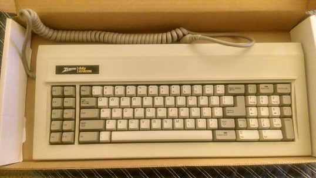

TMK with support for the Zenith Z-150
=====================================

This repo adds support for the Zenith Data Systems Z-150 keyboard that speaks an "XT-like" protocol but requires the RST line and a few other protocol changes.  The code reportedly works very well on multiple Z-150 boards, including mine.  No keystrokes are dropped.

I'll post more documentation here soon.  For now, grab the pre-compiled .hex file [here](https://github.com/namato/tmk_z150/tree/master/binary) (compiled for the Teensy 2.0), or build from source following the instructions for TMK.  Note that it cannot be made to work with the Orhalicon converter, because there is no way to load your own firmware onto it.

These keyboards are very well built and usually have Alps SKCL Green switches.  I've never seen one with  Alps SKCL Yellow but they apparently do exist.

For TMK, the latest source code is available here: <http://github.com/tmk/tmk_keyboard>

